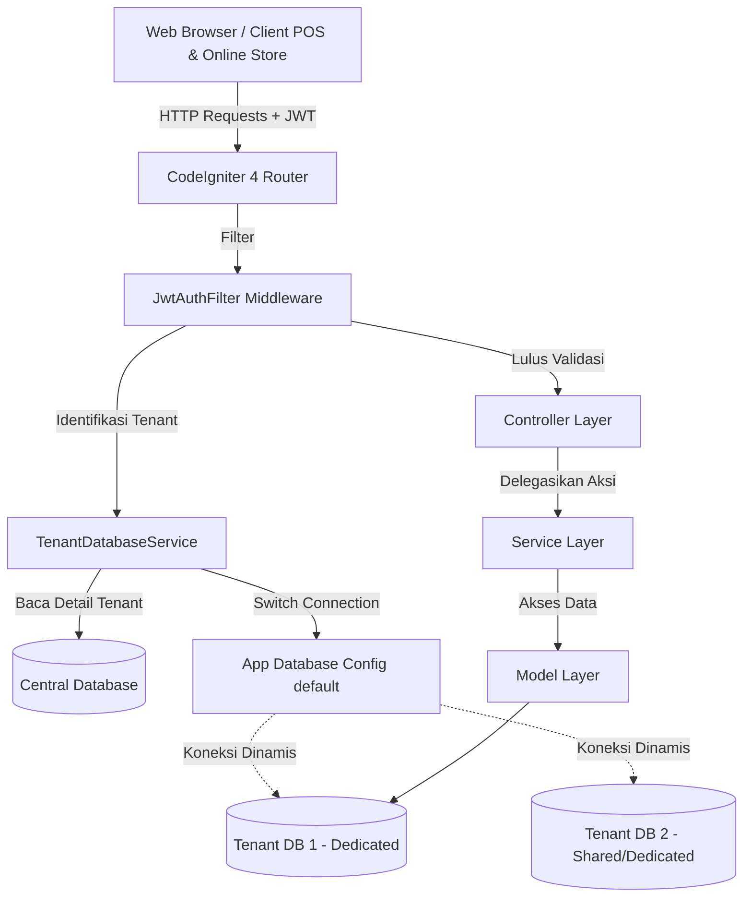
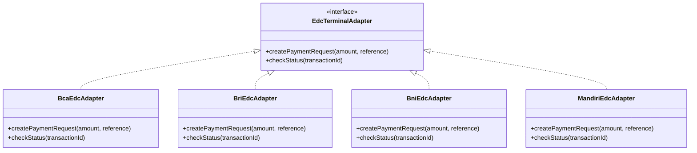
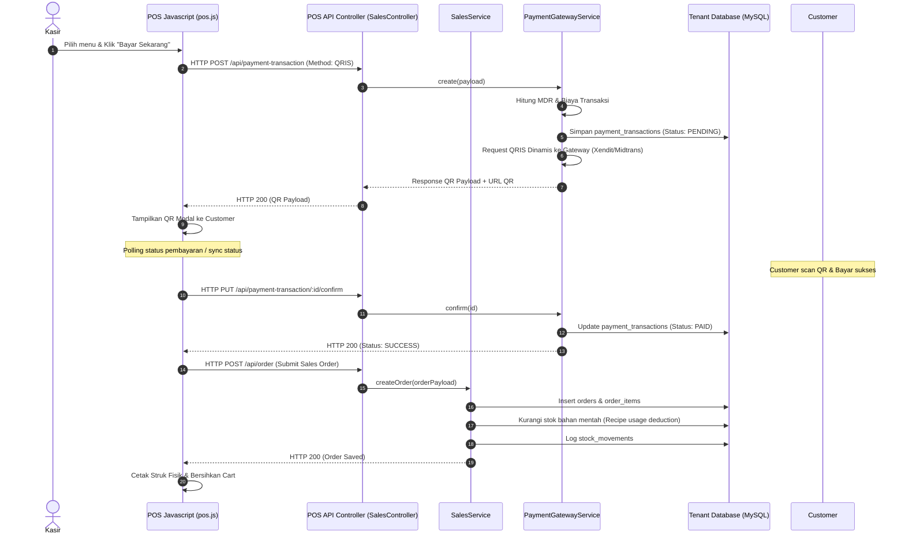

# 02. System Architecture

## Sistem Arsitektur (Multi-Tenancy Strategy)
Aplikasi ini diimplementasikan sebagai platform **SaaS Multi-Tenant** menggunakan model hybrid database tenancy:
1. **Shared Database (Central)**: Database sentral menyimpan data global seperti pemetaan tenant (`companies`), daftar lisensi tenant, data registrasi user utama, dan log transaksi central.
2. **Dedicated Database (Tenant)**: Setiap tenant perusahaan dapat dikonfigurasi untuk memiliki database MySQL terpisah secara fisik (`dedicated` mode). Skema database tenant berisi data transaksional khusus (orders, products, ingredients, roles, app_settings, dll.).

Isolasi data berjalan di level middleware (`TenantDatabaseService`). Setiap request API yang masuk memiliki header otorisasi JWT atau parameter route slug `/company-slug/`. Middleware mengidentifikasi tenant, mengambil kredensial database tenant dari tabel sentral `companies`, lalu secara dinamis mengubah konfigurasi grup database `default` di runtime.

## Layering & Tanggung Jawab (Layers)

### 1. Presentation Layer (Frontend / SPA)
- **Halaman Statis**: Menggunakan template HTML5 murni (`/public/pages/pos.html`, `settings.html`, dll.).
- **Javascript Client (`/public/scripts/`)**: Modul-modul ES6 (seperti `pos.js`, `settings.js`, `store.js`) menangani local state management, integrasi DOM, event listener, validasi form, dan rendering dinamis UI tanpa rendering ulang seluruh halaman.
- **Local Cache**: Menyimpan token JWT dan status session di `localStorage` melalui helper `loadSession()` dan `saveSession()` di `store.js`.

### 2. Router & Filter Layer (Middleware)
- **CodeIgniter 4 Routes (`Config/Routes.php`)**: Menerima request URL, memisahkan grup API publik dengan API terproteksi (`jwt-auth`).
- **JwtAuthFilter (`Filters/JwtAuthFilter.php`)**: Membaca token JWT dari header `Authorization: Bearer <token>`, memvalidasi masa berlaku, memecah payload (`claims`), dan memanggil `TenantDatabaseService` untuk mengaktifkan koneksi database tenant yang sesuai.

### 3. Controller Layer
- **Page Controllers** (`PosController`, `SettingsPageController`, dll.): Menangani pemuatan halaman HTML utama dan memanggil method `bootstrap()` untuk menghasilkan data awal katalog, pengguna, dan transaksi dalam satu request terpadu.
- **API Controllers** (`SalesController`, `InventoryController`, `AuthController`): Berfungsi sebagai endpoint REST API yang menerima input JSON, memvalidasi input dasar, memanggil Service Layer, dan mengembalikan response JSON seragam (`ok: true/false`, `data: [...]`, `message: "..."`).

### 4. Service Layer (Business Logic)
Lapisan terpenting di mana semua aturan bisnis didefinisikan secara independen dari framework. Contoh:
- **`SalesService`**: Mengelola siklus hidup pesanan, kalkulasi pajak, service charge, packaging fee, ready stock check, dan settlement closing.
- **`InventoryService`**: Mengelola pembukuan bahan baku, pemotongan stok otomatis berdasarkan resep menu, stock movement log, dan pembuangan inventaris rusak (*waste*).
- **`PaymentGatewayService`**: Mengintegrasikan API Xendit/Midtrans dan memproses webhook status pembayaran.
- **`TenantDatabaseProvisioningService`**: Otomatisasi pembuatan database tenant baru dan menjalankan migrasi skema tabel tenant via CLI command.

### 5. Model Layer (Data Access)
- **CodeIgniter Models** (`OrderModel`, `ProductModel`, `IngredientModel`): Mewarisi `BaseAppModel` atau `CodeIgniter\Model` untuk menangani operasi CRUD database, relasi query, soft-deletes, dan tracking timestamps otomatis (`created_at`, `updated_at`, `deleted_at`).

---

## Design Patterns

### 1. Model-View-Presenter (MVP) / Bootstrap Pattern
Untuk mengoptimalkan pemuatan halaman Single Page Application (SPA), server menggunakan Presenter (`PosPagePresenter`, `SettingsPagePresenter`) untuk menyatukan beberapa query data master menjadi satu paket respon payload ("bootstrap payload"). Ini mengurangi *round-trip latency* HTTP requests pada perangkat POS kasir.

### 2. Service-Oriented Architecture (SOA)
Seluruh controller tipis (*thin controllers*) mendelegasikan business logic yang rumit ke service gemuk (*fat services*). Controller tidak melakukan query database langsung maupun manipulasi data transaksional.

### 3. Strategy Pattern (Payment EDC Integration)
Integrasi EDC fisik menggunakan Strategy Pattern. Service `Payments` memanggil `EdcTerminalAdapter` yang memiliki implementasi konkrit untuk berbagai bank (`BcaEdcAdapter`, `BriEdcAdapter`, `BniEdcAdapter`, `MandiriEdcAdapter`) melalui kontrak *interface* yang seragam.

---

## Event Flow & Data Lifecycle (Checkout & Payment Flow)
Berikut adalah alur data lengkap saat kasir memproses transaksi QRIS/Card di kasir POS:

