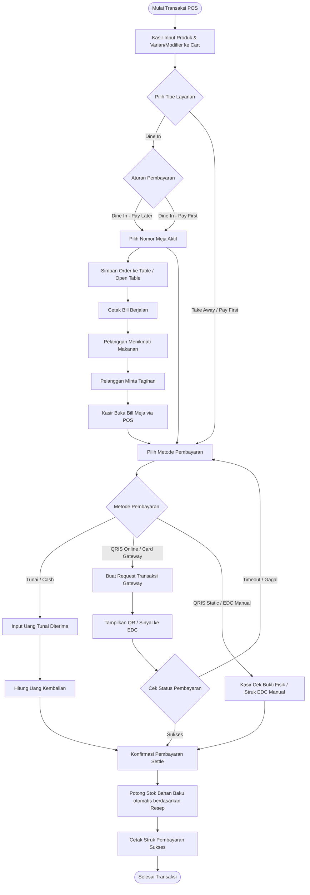
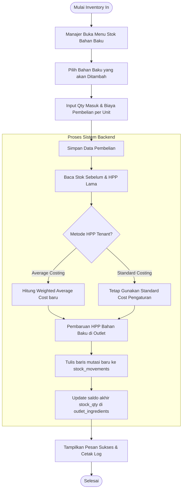

# 04. Business Processes

Dokumentasi proses bisnis utama pada Aplikasi UMKM (IFresso Coffee) digambarkan menggunakan flowchart, activity diagram, dan sequence diagram berbasis Mermaid.

---

## 1. Proses Bisnis: Point of Sale (POS) Checkout & Settlement
POS Checkout menangani pembelian oleh pelanggan langsung di outlet, baik menggunakan metode duduk makan di tempat (*Dine In*) dengan sistem bayar belakangan (*Pay Later*) maupun bawa pulang (*Take Away* / *Pay First*).

### Flowchart POS Checkout & Settlement


---

## 2. Proses Bisnis: Pemesanan Mandiri Pelanggan (Online QR Order)
Pelanggan men-scan QR code di meja untuk membuka menu digital, memesan secara mandiri, mengunggah bukti pembayaran, dan menunggu persetujuan kasir serta persiapan dapur.

### Activity Diagram Online QR Order
```mermaid
stateDiagram-v2
    [*] --> ScanQR: Pelanggan scan QR Code Meja
    ScanQR --> BrowseMenu: Halaman Online Menu Terbuka
    BrowseMenu --> AddToCart: Pelanggan Pilih Menu & Varian
    AddToCart --> Checkout: Pelanggan Masukkan Nama & No Telp
    Checkout --> SelectPayment: Pilih Metode Pembayaran (QRIS / Transfer / Tunai di Kasir)
    
    state SelectPayment {
        [*] --> OfflineProof: QRIS Static / Transfer Bank
        OfflineProof --> UploadImage: Pelanggan Upload Gambar Bukti Bayar
        UploadImage --> SubmitOrder: Submit Order ke Server
        
        [*] --> PayAtCashier: Bayar Tunai di Kasir
        PayAtCashier --> SubmitOrder
    }
    
    SubmitOrder --> PendingCashier: Status Order: PENDING_CASHIER
    PendingCashier --> NotificationSent: Kirim Sinyal Pesanan Masuk ke POS Kasir
    
    state POS_Kasir {
        NotificationSent --> ReviewOrder: Kasir buka Detail Pesanan di Panel Approval
        ReviewOrder --> VerifyProof: Kasir Cek Bukti Transfer vs Rekening Bank
        VerifyProof --> Action{Keputusan Kasir}
        Action --> RejectOrder: Bukti Tidak Valid / Stok Kosong
        RejectOrder --> CancelOrder: Batalkan Order & Lepas Hold Stok
        Action --> ApproveOrder: Bukti Valid & Stok Cukup
        ApproveOrder --> StatusWaiting: Status Order: WAITING (Kirim ke Dapur)
    }
    
    StatusWaiting --> KDS_Prep: Dapur Mulai Proses Masak (Status: PREPARING)
    KDS_Prep --> ReadyServe: Dapur Selesai Masak (Status: READY)
    ReadyServe --> Served: Staf Antarkan Makanan ke Meja (Status: COMPLETED)
    Served --> [*]
```

---

## 3. Proses Bisnis: Pembelian Bahan Baku (Purchase & Inventory Flow)
Pengadaan stok bahan mentah oleh manajer outlet untuk memastikan kelancaran operasional dapur.

### Flowchart Pembelian Bahan Baku

