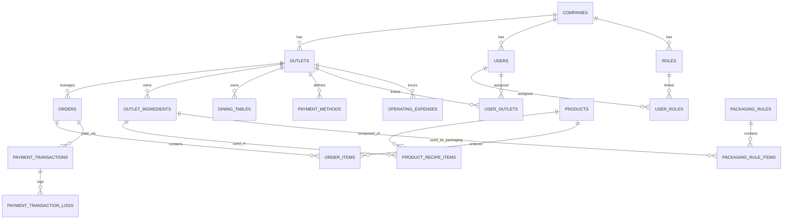

# 10. Database Schema & Data Dictionary

Dokumentasi lengkap seluruh 35 tabel database relasional (skema tenant) pada Aplikasi UMKM (IFresso Coffee).

---

## 1. Entity Relationship Diagram (ERD) - High Level
Semua tabel di dalam skema tenant berelasi secara terstruktur dengan relasi integritas referensial.

---

## 2. Kamus Data (Data Dictionary) Lengkap

Berikut adalah deskripsi skema struktur kolom dari seluruh 35 tabel yang dideklarasikan melalui migration database.

### 1. `companies`
Menyimpan profil badan usaha tenant.
- **`id`** (INT UNSIGNED, PK, Auto Increment): ID internal perusahaan.
- **`name`** (VARCHAR(160)): Nama legal perusahaan.
- **`brand_name`** (VARCHAR(160)): Nama merek dagang.
- **`route_slug`** (VARCHAR(120), Unique): Slug URL routing tenant (misal: `ifresso-coffee`).
- **`tagline`** (VARCHAR(160)): Slogan usaha.
- **`logo_path`** (VARCHAR(255)): Path URL gambar logo.
- **`theme_color`** (VARCHAR(32)): Kode warna heksadesimal tema UI.
- **`status`** (VARCHAR(2)): Status perusahaan (10: Aktif, 90: Nonaktif).

### 2. `outlets`
Cabang/gerai fisik di bawah naungan perusahaan.
- **`id`** (INT UNSIGNED, PK, Auto Increment): ID outlet.
- **`company_id`** (INT UNSIGNED, FK): ID perusahaan.
- **`name`** (VARCHAR(160)): Nama gerai cabang.
- **`code`** (VARCHAR(32)): Kode unik gerai (Index: `company_id`, `code`).
- **`address`** (TEXT): Alamat fisik gerai.
- **`status`** (VARCHAR(2)): Status keaktifan outlet.

### 3. `users`
Data login seluruh pengguna (staf, kasir, admin).
- **`id`** (INT UNSIGNED, PK, Auto Increment): ID user.
- **`company_id`** (INT UNSIGNED, FK): ID perusahaan.
- **`name`** (VARCHAR(160)): Nama lengkap.
- **`email`** (VARCHAR(160), Unique): Email login.
- **`password_hash`** (VARCHAR(255)): Hash password (bcrypt).
- **`type`** (VARCHAR(32)): Tipe user (`super_admin`, `company_admin`, `company_user`).
- **`status`** (VARCHAR(2)): Status user.

### 4. `roles`
Role otoritas akses.
- **`id`** (INT UNSIGNED, PK, Auto Increment): ID role.
- **`company_id`** (INT UNSIGNED, FK): ID perusahaan.
- **`name`** (VARCHAR(120)): Nama jabatan/role (misal: "Cashier").
- **`scope`** (VARCHAR(32)): Cakupan role (`single_outlet`, `all_outlets`).
- **`permissions`** (JSON): Matriks otorisasi module.

### 5. `user_roles`
Tabel jembatan pemetaan banyak-ke-banyak (*many-to-many*) user dengan role.
- **`user_id`** (INT UNSIGNED, PK/FK): ID user.
- **`role_id`** (INT UNSIGNED, PK/FK): ID role.

### 6. `user_outlets`
Tabel jembatan hak akses user ke gerai.
- **`user_id`** (INT UNSIGNED, PK/FK): ID user.
- **`outlet_id`** (INT UNSIGNED, PK/FK): ID outlet.

### 7. `categories`
Kategori menu jualan (misal: Espresso, Non-Coffee, Pastry).
- **`id`** (INT UNSIGNED, PK, Auto Increment): ID kategori.
- **`company_id`** (INT UNSIGNED, FK): ID perusahaan.
- **`outlet_id`** (INT UNSIGNED, FK, Nullable): ID outlet jika kategori bersifat lokal.
- **`name`** (VARCHAR(120)): Nama kategori.
- **`description`** (TEXT): Deskripsi kategori.
- **`scope`** (VARCHAR(24)): Cakupan (`company` atau `outlet`).
- **`status`** (VARCHAR(2)): Status aktif.

### 8. `products`
Katalog item menu jualan.
- **`id`** (INT UNSIGNED, PK, Auto Increment): ID produk.
- **`company_id`** (INT UNSIGNED, FK): ID perusahaan.
- **`outlet_id`** (INT UNSIGNED, FK, Nullable): ID outlet jika produk bersifat lokal.
- **`sku`** (VARCHAR(64)): Kode SKU produk (Unique: `company_id`, `sku`).
- **`name`** (VARCHAR(160)): Nama produk menu.
- **`description`** (TEXT): Deskripsi produk.
- **`image_path`** (VARCHAR(255)): File path gambar menu.
- **`selling_price`** (DECIMAL(14,2)): Harga jual dasar.
- **`scope`** (VARCHAR(24)): Tipe cakupan.
- **`recipe_status`** (VARCHAR(2)): Penanda resep (00: Tanpa Resep, 10: Menggunakan Resep BOM).
- **`is_preorder`** (TINYINT): Mendukung preorder (0/1).
- **`status`** (VARCHAR(2)): Status aktif produk.

### 9. `modifiers`
Group varian pilihan tambahan (misal: "Level Gula", "Topping").
- **`id`** (INT UNSIGNED, PK, Auto Increment): ID modifier.
- **`company_id`** (INT UNSIGNED, FK): ID perusahaan.
- **`name`** (VARCHAR(160)): Nama group modifier.
- **`selection_type`** (VARCHAR(32)): Aturan seleksi (`optional` atau `required`).

### 10. `modifier_options`
Pilihan item di dalam modifier group.
- **`id`** (INT UNSIGNED, PK, Auto Increment): ID opsi.
- **`modifier_id`** (INT UNSIGNED, FK): ID modifier induk.
- **`name`** (VARCHAR(160)): Nama pilihan (misal: "Less Sugar", "Gula Aren").
- **`price_delta`** (DECIMAL(14,2)): Perubahan selisih harga (+/-).
- **`ingredient_rules`** (JSON): Aturan pemotongan bahan baku khusus opsi ini.

### 11. `ingredient_templates`
Data master referensi bahan baku tingkat pusat perusahaan.
- **`id`** (INT UNSIGNED, PK, Auto Increment): ID template.
- **`company_id`** (INT UNSIGNED, FK): ID perusahaan.
- **`code`** (VARCHAR(80)): Kode unik bahan baku (Unique: `company_id`, `code`).
- **`name`** (VARCHAR(160)): Nama bahan baku template.
- **`category`** (VARCHAR(80)): Kategori bahan baku.
- **`unit`** (VARCHAR(32)): Satuan takaran standar (gram, ml, pcs).

### 12. `outlet_ingredients`
Stok fisik riil bahan baku mentah per outlet.
- **`id`** (INT UNSIGNED, PK, Auto Increment): ID bahan outlet.
- **`company_id`** (INT UNSIGNED, FK)
- **`outlet_id`** (INT UNSIGNED, FK)
- **`template_id`** (INT UNSIGNED, FK, Nullable)
- **`sku`** (VARCHAR(64)): Kode SKU bahan.
- **`name`** (VARCHAR(160)): Nama bahan baku.
- **`stock_qty`** (DECIMAL(14,3)): Jumlah stok saat ini.
- **`minimum_stock`** (DECIMAL(14,3)): Batas minimum stok.
- **`average_cost`** (DECIMAL(14,2)): Nilai HPP Rata-rata berjalan (Weighted Average).
- **`standard_cost`** (DECIMAL(14,2)): Nilai HPP Standar.

### 13. `product_recipe_items`
Tabel formula resep produk (BOM / Bill of Materials).
- **`id`** (INT UNSIGNED, PK, Auto-Increment)
- **`company_id`** (INT UNSIGNED, FK)
- **`product_id`** (INT UNSIGNED, FK): ID produk menu.
- **`template_id`** (INT UNSIGNED, FK): ID template bahan baku yang dikonsumsi.
- **`qty`** (DECIMAL(14,3)): Kuantitas bahan baku yang digunakan.
- **`unit`** (VARCHAR(32)): Satuan takaran bahan.

### 14. `stock_movements`
Log riwayat mutasi keluar masuk stok bahan baku di outlet.
- **`id`** (INT UNSIGNED, PK, Auto Increment)
- **`company_id`** (INT UNSIGNED, FK)
- **`outlet_id`** (INT UNSIGNED, FK)
- **`outlet_ingredient_id`** (INT UNSIGNED, FK): ID bahan baku outlet terkait.
- **`movement_type`** (VARCHAR(40)): Jenis mutasi (`purchase`, `sales_deduction`, `waste`, `production_in`, `production_out`).
- **`reference_type`** (VARCHAR(40), Nullable): Referensi modul (`orders`, `purchases`).
- **`reference_id`** (INT UNSIGNED, Nullable): ID baris modul referensi.
- **`stock_before`** (DECIMAL(14,3)): Stok sebelum mutasi.
- **`qty_in`** (DECIMAL(14,3)): Kuantitas masuk.
- **`qty_out`** (DECIMAL(14,3)): Kuantitas keluar.
- **`stock_after`** (DECIMAL(14,3)): Stok setelah mutasi.
- **`unit_cost`** (DECIMAL(14,2)): Nilai HPP satuan saat mutasi.
- **`total_cost`** (DECIMAL(14,2)): Total nilai HPP mutasi (`qty` * `unit_cost`).
- **`notes`** (TEXT): Catatan penjelas mutasi.

### 15. `orders`
Tabel transaksi utama pesanan penjualan (POS & Online).
- **`id`** (INT UNSIGNED, PK, Auto Increment)
- **`company_id`** (INT UNSIGNED, FK)
- **`outlet_id`** (INT UNSIGNED, FK)
- **`order_no`** (VARCHAR(64), Unique)
- **`service_type`** (VARCHAR(32)): `Dine In`, `Take Away`.
- **`customer_name`** (VARCHAR(160))
- **`table_name`** (VARCHAR(80))
- **`status`** (VARCHAR(2)): Kode status (10: Pending Cashier, 20: Waiting, 50: Completed).
- **`payment_status`** (VARCHAR(2)): Kode status (00: Unpaid, 20: Paid).
- **`subtotal`** (DECIMAL(14,2)): Total belanja item.
- **`packaging_fee`** (DECIMAL(14,2)): Biaya kemasan.
- **`payment_fee`** (DECIMAL(14,2)): MDR.
- **`tax_total`** (DECIMAL(14,2)): Total PPN.
- **`grand_total`** (DECIMAL(14,2)): Total tagihan akhir.
- **`cogs_total`** (DECIMAL(14,2)): Total HPP transaksi.
- **`payment_proof_path`** (VARCHAR(255)): Lokasi unggahan gambar bukti bayar.

### 16. `order_items`
Rincian item produk yang terjual dalam satu pesanan.
- **`id`** (INT UNSIGNED, PK, Auto Increment)
- **`order_id`** (INT UNSIGNED, FK)
- **`product_id`** (INT UNSIGNED, FK)
- **`product_name`** (VARCHAR(160))
- **`qty`** (DECIMAL(14,3))
- **`unit_price`** (DECIMAL(14,2))
- **`line_total`** (DECIMAL(14,2))
- **`cogs_total`** (DECIMAL(14,2))
- **`modifier_snapshot`** (JSON): Snapshot varian modifier terpilih saat dibeli.
- **`recipe_snapshot`** (JSON): Snapshot formula bahan baku terpakai saat itu.

### 17. `dining_tables`
Daftar meja Dine-In outlet.
- **`id`** (INT UNSIGNED, PK, Auto Increment)
- **`company_id`** (INT UNSIGNED, FK)
- **`outlet_id`** (INT UNSIGNED, FK)
- **`name`** (VARCHAR(80)): Nomor/Nama Meja.
- **`area`** (VARCHAR(80)): Area (Indoor, Outdoor).
- **`capacity`** (INT UNSIGNED): Kapasitas kursi.
- **`sort_order`** (INT): Urutan penyajian.
- **`status`** (VARCHAR(24)): Status meja (`active` atau `inactive`).

### 18. `payment_methods`
Konfigurasi metode pembayaran outlet.
- **`id`** (INT UNSIGNED, PK, Auto-Increment)
- **`company_id`** (INT UNSIGNED, FK)
- **`outlet_id`** (INT UNSIGNED, FK)
- **`name`** (VARCHAR(100)): Nama metode (Cash, QRIS, BCA EDC).
- **`type`** (VARCHAR(32)): Kategori (`cash`, `qris`, `card`, `transfer`, `ewallet`).
- **`gateway_provider`** (VARCHAR(40)): `manual`, `xendit`, `midtrans`.
- **`channel_code`** (VARCHAR(80)): Kode channel bank acquirer (misal: `BCA`, `QRIS`).
- **`terminal_id`** (VARCHAR(80)): ID Mesin EDC.
- **`edc_mode`** (VARCHAR(32)): `manual` atau `integrated`.
- **`merchant_id`** (VARCHAR(120)): MID Merchant.
- **`terminal_serial`** (VARCHAR(120)): Serial terminal EDC.
- **`connector_status`** (VARCHAR(32)): Status integrasi terminal.
- **`use_sandbox`** (TINYINT): Mode sandbox testing (0/1).
- **`fee_rate`** (DECIMAL(8,3)): Nilai rate MDR (%).
- **`fee_payer`** (VARCHAR(24)): Pihak pembayar MDR (`merchant` atau `customer`).
- **`account`** (VARCHAR(160)): Rekening settlement jurnal.
- **`sort_order`** (INT)
- **`status`** (VARCHAR(24))

### 19. `packaging_rules`
Aturan pengenaan biaya kemasan (packaging) otomatis berdasarkan kuantitas item.
- **`id`** (INT UNSIGNED, PK, Auto Increment)
- **`company_id`** (INT UNSIGNED, FK)
- **`outlet_id`** (INT UNSIGNED, FK)
- **`name`** (VARCHAR(120)): Deskripsi nama rule.
- **`min_qty`** (INT UNSIGNED): Batas minimal kuantitas order untuk memicu rule.
- **`max_qty`** (INT UNSIGNED): Batas maksimal kuantitas order.
- **`status`** (VARCHAR(24))

### 20. `packaging_rule_items`
Rincian jenis bahan kemasan yang dipakai dalam satu rule.
- **`id`** (INT UNSIGNED, PK, Auto Increment)
- **`packaging_rule_id`** (INT UNSIGNED, FK)
- **`outlet_ingredient_id`** (INT UNSIGNED, FK): Bahan kemasan mentah di outlet.
- **`qty`** (DECIMAL(14,3)): Kebutuhan kuantitas kemasan.
- **`price`** (DECIMAL(14,2)): Harga kemasan dibebankan.
- **`is_fallback`** (TINYINT): Kemasan pengganti jika bahan utama kosong (0/1).

### 21. `product_modifiers`
Tabel pemetaan relasi produk dengan modifier group (*many-to-many*).
- **`product_id`** (INT UNSIGNED, PK/FK)
- **`modifier_id`** (INT UNSIGNED, PK/FK)

### 22. `app_settings`
Setelan variabel operasional tenant tingkat outlet.
- **`id`** (INT UNSIGNED, PK, Auto Increment)
- **`company_id`** (INT UNSIGNED, FK)
- **`outlet_id`** (INT UNSIGNED, FK, Nullable)
- **`setting_key`** (VARCHAR(120)): Kunci setelan (misal: `tax_rate`, `dine_in_service_rate`).
- **`setting_value`** (TEXT): Nilai konfigurasi.

### 23. `product_outlet_prices`
Harga jual produk yang diset khusus tingkat outlet lokal.
- **`product_id`** (INT UNSIGNED, PK/FK)
- **`outlet_id`** (INT UNSIGNED, PK/FK)
- **`price`** (DECIMAL(14,2)): Harga jual kustom outlet.

### 24. `modifier_option_outlet_prices`
Harga delta modifier pilihan yang diset khusus tingkat outlet lokal.
- **`modifier_option_id`** (INT UNSIGNED, PK/FK)
- **`outlet_id`** (INT UNSIGNED, PK/FK)
- **`price_delta`** (DECIMAL(14,2))

### 25. `outlet_ingredient_mappings`
Pemetaan bahan baku pusat ke outlet lokal.
- **`id`** (INT UNSIGNED, PK, Auto-Increment)
- **`company_id`** (INT UNSIGNED, FK)
- **`outlet_id`** (INT UNSIGNED, FK)
- **`template_id`** (INT UNSIGNED, FK)
- **`outlet_ingredient_id`** (INT UNSIGNED, FK)

### 26. `ingredient_lots`
Manajemen lot kedaluwarsa & batch masuk bahan baku mentah.
- **`id`** (INT UNSIGNED, PK, Auto Increment)
- **`company_id`** (INT UNSIGNED, FK)
- **`outlet_ingredient_id`** (INT UNSIGNED, FK)
- **`lot_number`** (VARCHAR(80)): Kode nomor lot dari supplier.
- **`expiry_date`** (DATE): Tanggal kedaluwarsa bahan baku.
- **`qty_received`** (DECIMAL(14,3)): Stok awal masuk.
- **`qty_remaining`** (DECIMAL(14,3)): Sisa stok saat ini.

### 27. `product_batches`
Stok produk jadi pre-packaged/pre-order yang sudah selesai diproduksi.
- **`id`** (INT UNSIGNED, PK, Auto Increment)
- **`company_id`** (INT UNSIGNED, FK)
- **`product_id`** (INT UNSIGNED, FK): ID produk.
- **`batch_number`** (VARCHAR(80)): Nomor batch produksi.
- **`production_date`** (DATE): Tanggal produksi dapur.
- **`expiry_date`** (DATE, Nullable): Tanggal kedaluwarsa produk jadi.
- **`qty_produced`** (DECIMAL(14,3)): Kuantitas produksi.
- **`qty_remaining`** (DECIMAL(14,3)): Sisa kuantitas stok di rak.

### 28. `product_batch_movements`
Mutasi keluar masuk stok batch produk jadi.
- **`id`** (INT UNSIGNED, PK, Auto Increment)
- **`product_batch_id`** (INT UNSIGNED, FK)
- **`movement_type`** (VARCHAR(40)): `production_in`, `sales_out`, `waste_out`.
- **`qty`** (DECIMAL(14,3))

### 29. `payment_transactions`
Invoice transaksi payment gateway online (Xendit/Midtrans) atau EDC.
- **`id`** (INT UNSIGNED, PK, Auto Increment)
- **`company_id`** (INT UNSIGNED, FK)
- **`outlet_id`** (INT UNSIGNED, FK)
- **`order_id`** (INT UNSIGNED, FK)
- **`order_no`** (VARCHAR(64))
- **`payment_method_id`** (INT UNSIGNED, FK)
- **`method_name`** (VARCHAR(100))
- **`method_type`** (VARCHAR(32))
- **`provider`** (VARCHAR(40)): `xendit`, `midtrans`, `manual_qris`, `manual_edc`.
- **`provider_reference`** (VARCHAR(120)): Kode invoice unik dari gateway API.
- **`amount`** (DECIMAL(14,2))
- **`fee_amount`** (DECIMAL(14,2))
- **`status`** (VARCHAR(32)): `pending`, `paid`, `failed`, `expired`.
- **`qr_payload`** (TEXT, Nullable): Payload string mentah untuk scan QRIS.
- **`edc_instruction`** (TEXT, Nullable): Instruksi penyelesaian terminal EDC.

### 30. `payment_transaction_logs`
Log audit histori HTTP request-response API ke server gateway (Xendit/Midtrans).
- **`id`** (INT UNSIGNED, PK, Auto Increment)
- **`payment_transaction_id`** (INT UNSIGNED, FK)
- **`direction`** (VARCHAR(20)): `incoming` (webhook) atau `outgoing` (API request).
- **`action`** (VARCHAR(80)): Kode aksi API (misal: `create_payment`).
- **`http_status`** (INT): Status HTTP response.
- **`request_payload`** (LONGTEXT): Parameter body request.
- **`response_payload`** (LONGTEXT): Body response balasan.

### 31. `operating_expenses`
Beban pengeluaran operasional outlet (OPEX).
- **`id`** (INT UNSIGNED, PK, Auto Increment)
- **`company_id`** (INT UNSIGNED, FK)
- **`outlet_id`** (INT UNSIGNED, FK)
- **`name`** (VARCHAR(160)): Deskripsi pengeluaran.
- **`category`** (VARCHAR(40)): Kategori pengeluaran (`operational`, `payroll`, `rent`, `utilities`).
- **`amount`** (DECIMAL(14,2)): Jumlah pengeluaran.
- **`expense_date`** (DATE): Tanggal transaksi.
- **`created_by`** (INT UNSIGNED, FK): ID user pembuat record.

### 32. `user_invitations`
Undangan kolaborasi staff baru.
- **`id`** (INT UNSIGNED, PK, Auto Increment)
- **`company_id`** (INT UNSIGNED, FK)
- **`email`** (VARCHAR(160)): Email target.
- **`code`** (VARCHAR(64), Unique): Token verifikasi unik.
- **`status`** (VARCHAR(24)): Status (`pending`, `accepted`, `expired`).
- **`expiry_at`** (DATETIME)

### 33. `product_outlet_categories`
Kustomisasi kategori menu khusus tingkat outlet lokal.
- **`category_id`** (INT UNSIGNED, PK/FK)
- **`outlet_id`** (INT UNSIGNED, PK/FK)
- **`status`** (VARCHAR(24))

### 34. `customer_members`
Keanggotaan loyalitas pelanggan (CRM).
- **`id`** (INT UNSIGNED, PK, Auto Increment)
- **`company_id`** (INT UNSIGNED, FK)
- **`name`** (VARCHAR(160))
- **`phone`** (VARCHAR(40)): Nomor telepon unik member.
- **`email`** (VARCHAR(160))
- **`status`** (VARCHAR(24))

### 35. `order_status_logs`
Log audit transisi status pesanan penjualan.
- **`id`** (INT UNSIGNED, PK, Auto-Increment)
- **`order_id`** (INT UNSIGNED, FK)
- **`from_status`** (VARCHAR(20))
- **`to_status`** (VARCHAR(20))
- **`actor_type`** (VARCHAR(40)): Pelaku (`cashier`, `customer`, `system`).
- **`actor_name`** (VARCHAR(160))
- **`notes`** (TEXT)
