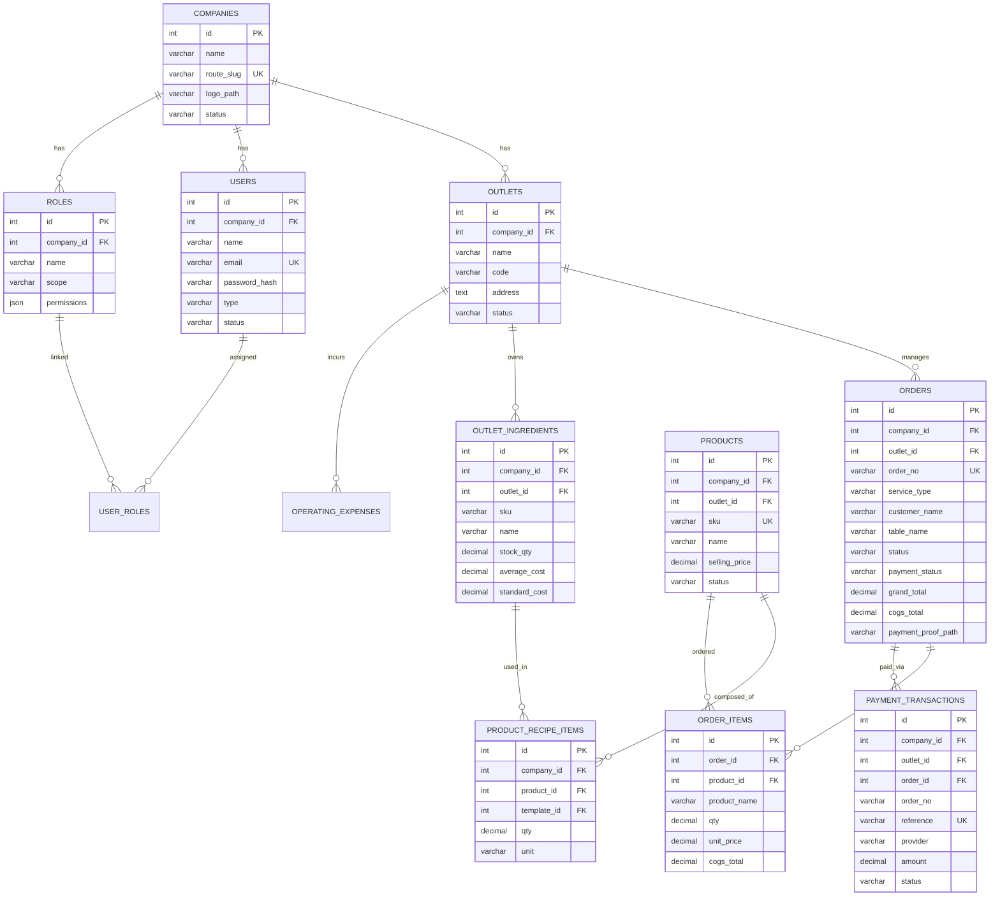

# 10. Database Schema & Data Dictionary

Dokumentasi rancangan skema database relasional (Tenant Schema) yang digunakan untuk menyimpan data bisnis gerai pada Aplikasi UMKM.

---

## 1. Entity Relationship Diagram (ERD)

---

## 2. Kamus Data (Data Dictionary) - Tabel Utama

### Tabel: `orders`
Menyimpan rangkuman transaksi penjualan POS maupun pesanan online.

| Nama Kolom | Tipe Data | Nullable | Default | Deskripsi |
|---|---|---|---|---|
| `id` | INT UNSIGNED | No | Auto Increment | Primary Key. ID internal pesanan. |
| `company_id` | INT UNSIGNED | No | - | Foreign Key ke tabel `companies`. |
| `outlet_id` | INT UNSIGNED | No | - | Foreign Key ke tabel `outlets`. |
| `order_no` | VARCHAR(64) | No | - | Unique Key. Nomor invoice unik (misal: WEB-20260719-0005). |
| `service_type` | VARCHAR(32) | No | - | Tipe pesanan: `Dine In`, `Take Away`, `Delivery`. |
| `customer_name`| VARCHAR(160)| Yes | NULL | Nama pelanggan pembuat pesanan. |
| `table_name` | VARCHAR(80) | Yes | NULL | Nama/nomor meja untuk pesanan dine-in. |
| `status` | VARCHAR(2) | No | '10' | Status order (10: PENDING_CASHIER, 20: WAITING, 50: COMPLETED). |
| `payment_status`| VARCHAR(2)| No | '00' | Status bayar (00: unpaid, 10: pending, 20: paid). |
| `subtotal` | DECIMAL(14,2)| No | 0.00 | Total harga produk sebelum biaya tambahan. |
| `packaging_fee`| DECIMAL(14,2)| No | 0.00 | Biaya kemasan/packaging. |
| `payment_fee` | DECIMAL(14,2)| No | 0.00 | MDR fee gateway pembayaran jika ditanggung pelanggan. |
| `tax_total` | DECIMAL(14,2)| No | 0.00 | Nominal PPN masukan penjualan. |
| `grand_total` | DECIMAL(14,2)| No | 0.00 | Total tagihan akhir yang wajib dilunasi. |
| `cogs_total` | DECIMAL(14,2)| No | 0.00 | Total HPP produk yang dihitung saat checkout. |
| `gross_profit` | DECIMAL(14,2)| No | 0.00 | Margin kotor penjualan (`grand_total` - `cogs_total`). |
| `payment_proof_path`| VARCHAR(255)| Yes| NULL | Path gambar bukti transfer/bukti bayar QRIS offline. |
| `created_at` | DATETIME | Yes | NULL | Timestamp pembuatan record. |

---

### Tabel: `outlet_ingredients`
Menyimpan ketersediaan bahan baku mentah tingkat outlet gerai lokal.

| Nama Kolom | Tipe Data | Nullable | Default | Deskripsi |
|---|---|---|---|---|
| `id` | INT UNSIGNED | No | Auto Increment | Primary Key. ID internal bahan outlet. |
| `company_id` | INT UNSIGNED | No | - | Foreign Key ke tabel `companies`. |
| `outlet_id` | INT UNSIGNED | No | - | Foreign Key ke tabel `outlets`. |
| `template_id` | INT UNSIGNED | Yes | NULL | Foreign Key ke `ingredient_templates` pusat. |
| `sku` | VARCHAR(64) | No | - | Kode SKU unik bahan baku. |
| `name` | VARCHAR(160)| No | - | Nama bahan baku (misal: "Biji Kopi robusta"). |
| `category` | VARCHAR(80) | Yes | NULL | Kategori bahan baku (misal: "Packaging", "Raw Material"). |
| `unit` | VARCHAR(32) | No | - | Satuan ukuran stok (misal: "gr", "ml", "pcs"). |
| `stock_qty` | DECIMAL(14,3)| No | 0.000 | Saldo stok fisik bahan saat ini di outlet. |
| `minimum_stock`| DECIMAL(14,3)| No | 0.000 | Limit alert untuk peringatan stok menipis. |
| `average_cost` | DECIMAL(14,2)| No | 0.00 | HPP rata-rata berjalan (Weighted Average Cost). |
| `standard_cost`| DECIMAL(14,2)| No | 0.00 | Nilai HPP standard yang diset manual untuk standard costing. |
| `status` | VARCHAR(2) | No | '10' | Status bahan (10: aktif, 90: nonaktif). |

---

### Tabel: `product_recipe_items`
Menyusun resep/BOM (Bill of Materials) dari produk menu jualan.

| Nama Kolom | Tipe Data | Nullable | Default | Deskripsi |
|---|---|---|---|---|
| `id` | INT UNSIGNED | No | Auto Increment | Primary Key. ID resep. |
| `company_id` | INT UNSIGNED | No | - | Foreign Key ke `companies`. |
| `product_id` | INT UNSIGNED | No | - | Foreign Key ke `products`. Menu yang dibuat resepnya. |
| `template_id` | INT UNSIGNED | Yes | NULL | ID template bahan mentah penyusun menu. |
| `qty` | DECIMAL(14,3)| No | - | Takaran jumlah bahan baku yang dikonsumsi per 1 unit porsi menu. |
| `unit` | VARCHAR(32) | No | - | Satuan takaran bahan baku (misal: "gr"). |
