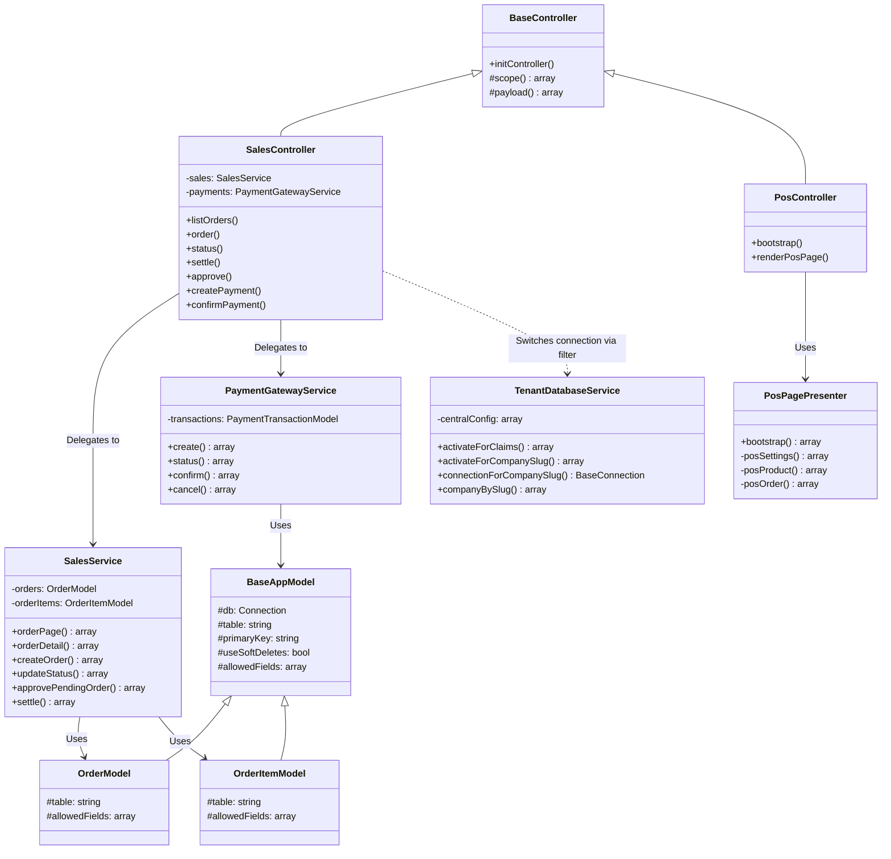

# 11. Class Diagram

Diagram kelas (Class Diagram) memvisualisasikan relasi OOP antara Controller, Service, Model, dan Presenter utama pada backend Aplikasi UMKM.

## Deskripsi Relasi
1. **Inheritance (Pewarisan)**:
   - `SalesController` dan `PosController` mewarisi `BaseController` yang menyediakan helper internal untuk membaca payload input JSON dan cakupan (*scope*) ID outlet/perusahaan.
   - `OrderModel` dan `OrderItemModel` mewarisi `BaseAppModel` yang membungkus fungsi utilitas CRUD framework CodeIgniter 4.
2. **Association (Asosiasi/Delegasi)**:
   - Controller layer bertindak sebagai *thin controller* dan mendelegasikan pemrosesan data ke Service layer (`SalesService`, `PaymentGatewayService`).
   - Service layer melakukan manipulasi database dengan memanggil Model layer (`OrderModel`, `OrderItemModel`).
3. **Usage (Penggunaan)**:
   - `PosController` memanggil `PosPagePresenter` untuk menyusun and memformat bootstrap data (settings, catalog, orders) ke client-side.
   - `TenantDatabaseService` dipanggil oleh filter middleware untuk memodifikasi koneksi database model secara dinamis.
