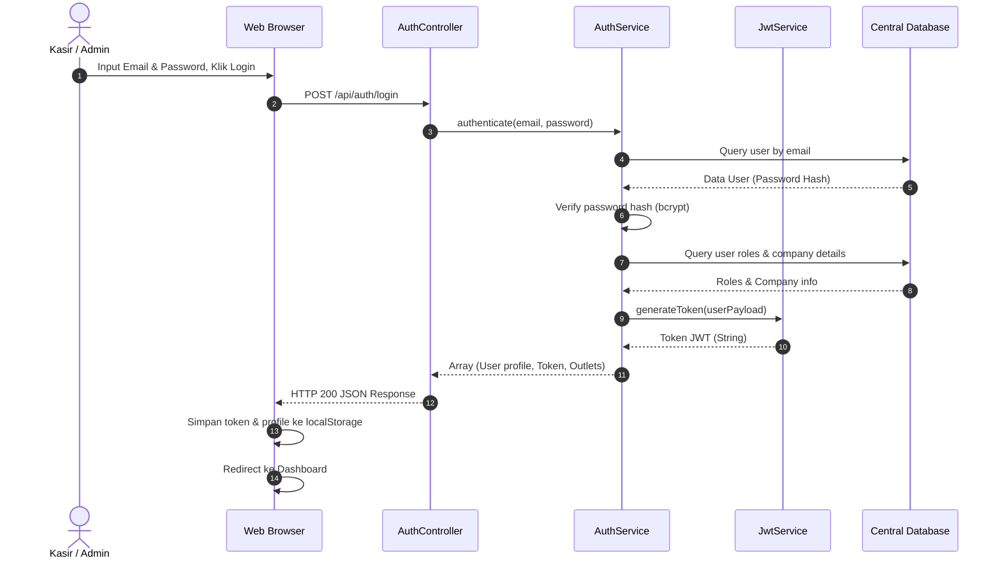
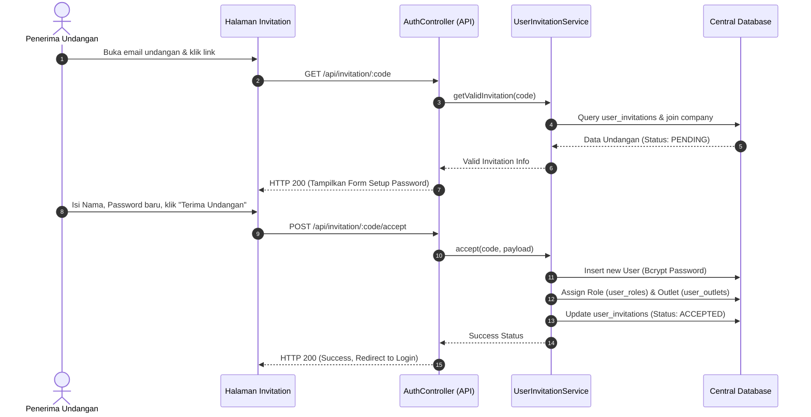
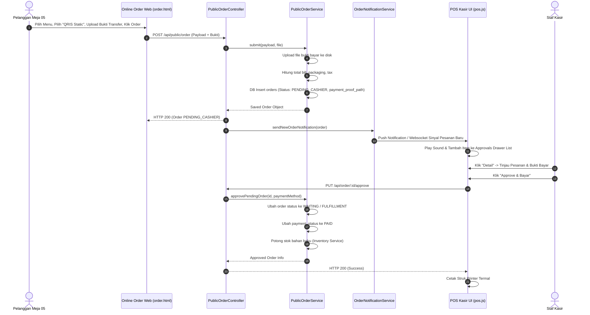

# 12. Sequence Diagrams

Dokumentasi diagram urutan (Sequence Diagram) untuk alur transaksi paling penting dalam Aplikasi UMKM.

---

## 1. Alur Autentikasi Pengguna (Login)

---

## 2. Alur Penerimaan Undangan User (Accept Invitation)

---

## 3. Alur Pesanan Pelanggan Online & Approval Kasir

