# 14. Component Diagram

Diagram Komponen (Component Diagram) memetakan modul-modul modular pada sisi klien (frontend), server (backend), database, dan layanan pihak ketiga (external integration).

```mermaid
graph TD
    subgraph Frontend_Client_Side [Web Client - Single Page Application]
        DOM[DOM Controller - dom.js]
        Format[Formatter - format.js]
        Store[Local Store - store.js & page-engine.js]
        
        subgraph JS_Pages [Page Script Components]
            POS_JS[POS Cashier - pos.js]
            Set_JS[Settings - settings.js]
            Ord_JS[Online Ordering - order.js]
            Inv_JS[Inventory - inventory.js]
        end
    end

    subgraph Backend_Server_Side [Application Server - CodeIgniter 4]
        Filter[JwtAuthFilter Middleware]
        
        subgraph MVC_Controllers [Controller Components]
            Sales_Ctrl[SalesController]
            Inv_Ctrl[InventoryController]
            Auth_Ctrl[AuthController]
            Page_Ctrl[AppPageController]
        end
        
        subgraph Business_Services [Business Service Components]
            Sales_Serv[SalesService]
            Inv_Serv[InventoryService]
            Auth_Serv[AuthService]
            Db_Serv[TenantDatabaseService]
            Pay_Serv[PaymentGatewayService]
        end
        
        subgraph DB_Models [Data Models]
            Order_Mod[OrderModel]
            Item_Mod[OrderItemModel]
            Ing_Mod[IngredientModel]
            Stock_Mod[StockMovementModel]
        end
    end

    subgraph Database_Tenants [Database Storage]
        Central_DB[(Central Database - MySQL)]
        Tenant_DBs[(Tenant Databases - SQLite / MySQL)]
    end

    subgraph External_Services [Third Party Providers]
        Xendit_API[Xendit Payment API]
        Midtrans_API[Midtrans Payment API]
        EDC_Terminals[Integrated EDC Hardware Bridge]
    end

    %% Client to Server Communication
    POS_JS & Set_JS & Ord_JS & Inv_JS -->|HTTP Requests / REST API| Filter
    Filter -->|Otorisasi & Routing DB| Db_Serv
    Filter --> MVC_Controllers
    
    %% JS internally uses dom & format & store
    JS_Pages --> DOM & Format & Store

    %% Controller to Services
    Sales_Ctrl --> Sales_Serv & Pay_Serv
    Inv_Ctrl --> Inv_Serv
    Auth_Ctrl --> Auth_Serv
    
    %% Services to Models
    Sales_Serv --> Order_Mod & Item_Mod
    Inv_Serv --> Ing_Mod & Stock_Mod
    Auth_Serv --> Central_DB
    
    %% Service Dynamic DB switching
    Db_Serv -->|Dynamic Config| Tenant_DBs
    Db_Serv --> Central_DB
    
    %% Models connect to Database
    DB_Models --> Tenant_DBs

    %% External APIs
    Pay_Serv --> Xendit_API & Midtrans_API & EDC_Terminals
```

## Deskripsi Komponen

1. **Frontend - Single Page Application**:
   - `store.js` & `page-engine.js` bertindak sebagai *state manager* lokal di browser. Mereka menampung session token, settings cache, dan memetakan respon payload server ke local memory.
   - Script halaman (`pos.js`, `settings.js`, dll.) memanggil API backend secara asinkron dan memicu rendering ulang UI secara parsial melalui `dom.js` (DOM selector/manipulator helper) dan `format.js` (formatter mata uang rupiah/angka decimal).

2. **Backend Controllers & Services**:
   - `JwtAuthFilter` menyaring request API. Jika request lolos validasi, filter mengaktifkan koneksi database tenant melalui `TenantDatabaseService`, baru kemudian meneruskan kontrol ke Controller yang dituju.
   - Komponen controller murni meneruskan parsing parameter request ke Service terkait yang membungkus logika alur transaksi (`SalesService`, `InventoryService`).

3. **External Integrations**:
   - `PaymentGatewayService` membungkus interaksi HTTP client ke server Xendit dan Midtrans, serta mengoperasikan adaptor terminal EDC bank yang terintegrasi fisik di outlet.
