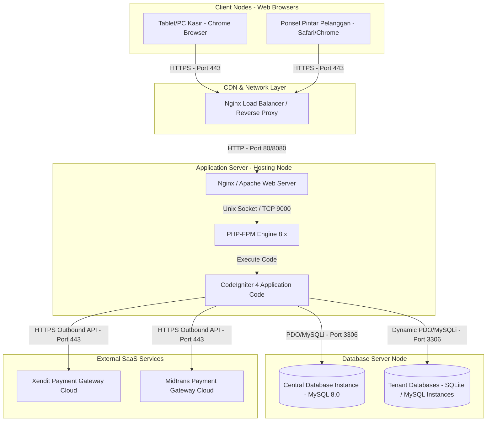

# 15. Deployment Diagram

Diagram Penyebaran (Deployment Diagram) menggambarkan infrastruktur fisik dan jaringan tempat Aplikasi UMKM dijalankan pada lingkungan produksi.

## Spesifikasi Node Infrastruktur

### 1. Client Devices (Klien POS & Pelanggan)
- **Klien POS (Tablet/Laptop)**: Perangkat kasir di gerai fisik. Menampilkan halaman POS SPA secara lokal. Berkomunikasi asinkron via AJAX/Fetch API ke Web Server.
- **Ponsel Pintar Pelanggan**: Mengakses halaman menu pemesanan mandiri menggunakan browser mobile saat men-scan QR code di meja.

### 2. CDN & Network Layer (Nginx Load Balancer)
- Bertindak sebagai gerbang masuk tunggal, mengelola sertifikat SSL/TLS untuk enkripsi komunikasi data (HTTPS), serta membagi beban traffic request ke beberapa instansi App Server Node.

### 3. Application Server Node (Web Server & PHP-FPM)
- **Web Server (Nginx)**: Melayani request aset statis (HTML, CSS, JS, Gambar menu) secara cepat, serta meneruskan request API dinamis (`/api/*`) ke PHP-FPM.
- **PHP-FPM 8.x**: Mesin pengeksekusi kode PHP yang dikonfigurasi dengan Opcache aktif untuk performa kompilasi script yang optimal.
- **CodeIgniter 4**: Source code aplikasi yang dipasang di server.

### 4. Database Server Node (MySQL Cluster)
- **MySQL 8.0**: Database engine utama yang menampung central database dan ribuan instansi database tenant secara efisien.
- **Isolasi Database**: Setiap tenant baru mendapatkan database tersendiri (`tenant_1`, `tenant_2`, dst.). Database ini dapat ditempatkan pada server database yang sama atau didelegasikan ke database server terpisah secara fisik (`db_host` khusus pada konfigurasi tenant).

### 5. External SaaS Services
- **Xendit & Midtrans Cloud API**: Layanan SaaS pihak ketiga yang memproses transaksi gateway keuangan dan mengirim callback status pembayaran via HTTPS Webhook ke endpoint `/api/webhook/xendit`.
