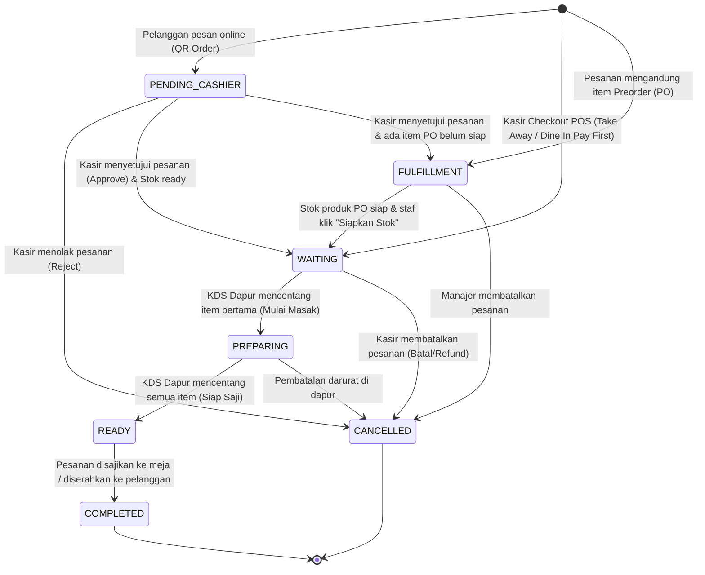
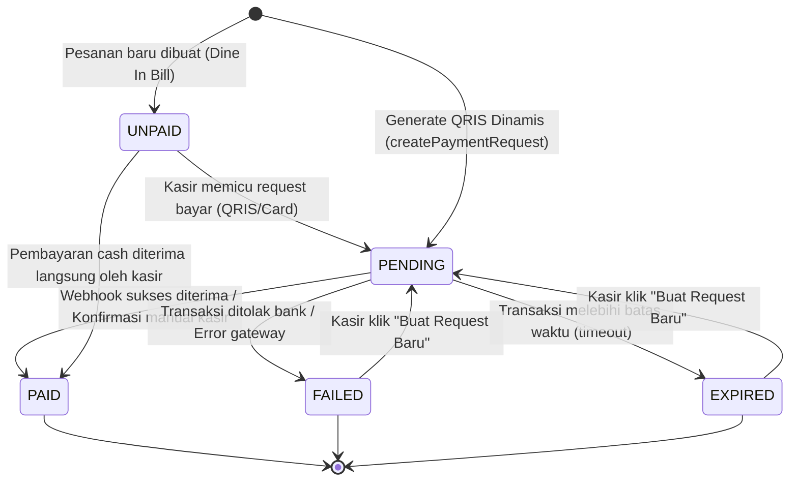

# 16. State Diagrams

Dokumentasi diagram transisi status (State Diagram) yang menggambarkan siklus hidup (lifecycle) pesanan dan transaksi pembayaran pada Aplikasi UMKM.

---

## 1. Siklus Hidup Status Pesanan (Order Status Lifecycle)

Order status berpindah melalui berbagai tahapan mulai dari pembuatan hingga penyajian akhir atau pembatalan.

### Penjelasan Transisi Status Order:
1. **`PENDING_CASHIER`**: Status awal untuk order online. Pesanan tertahan di laci approval kasir dan belum dikirim ke kitchen. Stok produk belum berkurang (hanya di-*hold*).
2. **`FULFILLMENT`**: Tahap penyiapan stok untuk menu pre-order (PO). Transaksi menunggu stok produk PO diproduksi terlebih dahulu.
3. **`WAITING`**: Pesanan masuk antrean dapur. Menunggu staf dapur mulai memproses pesanan.
4. **`PREPARING`**: Staf dapur telah mengonfirmasi pembuatan pesanan. Proses memasak dimulai.
5. **`READY`**: Seluruh item dalam pesanan telah siap disajikan. Notifikasi berbunyi di kasir.
6. **`COMPLETED`**: Pelanggan telah menerima produk. Transaksi ditutup secara permanen.
7. **`CANCELLED`**: Pesanan dibatalkan. Kunci stok dibebaskan kembali ke gudang.

---

## 2. Status Transaksi Pembayaran (Payment Transaction States)

Melacak status pembayaran transaksi yang dipicu lewat QRIS Dinamis atau EDC Bank terintegrasi.

### Penjelasan Transisi Status Payment:
1. **`UNPAID`**: Transaksi dine-in berjalan belum dilunasi. Tagihan terus bertambah jika ada pesanan tambahan.
2. **`PENDING`**: Request pembayaran dikirim ke API Xendit/Midtrans atau terminal EDC fisik. Status menunggu pembayaran dari pelanggan.
3. **`PAID`**: Transaksi sukses didebit/diterima. Gateway mengirim status sukses, melunasi tagihan order terkait secara otomatis.
4. **`FAILED`**: Kartu ditolak atau terjadi kegerakan jaringan pada terminal EDC.
5. **`EXPIRED`**: Pelanggan tidak memindai QRIS dalam batas waktu toleransi (misalnya 15 menit), sehingga invoice dibatalkan oleh gateway.
