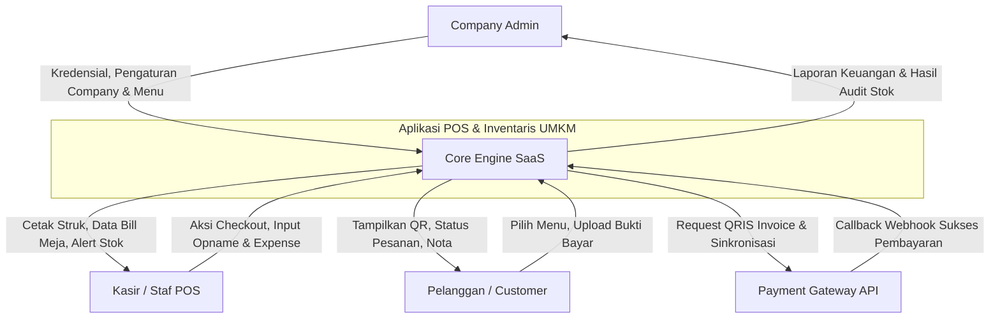
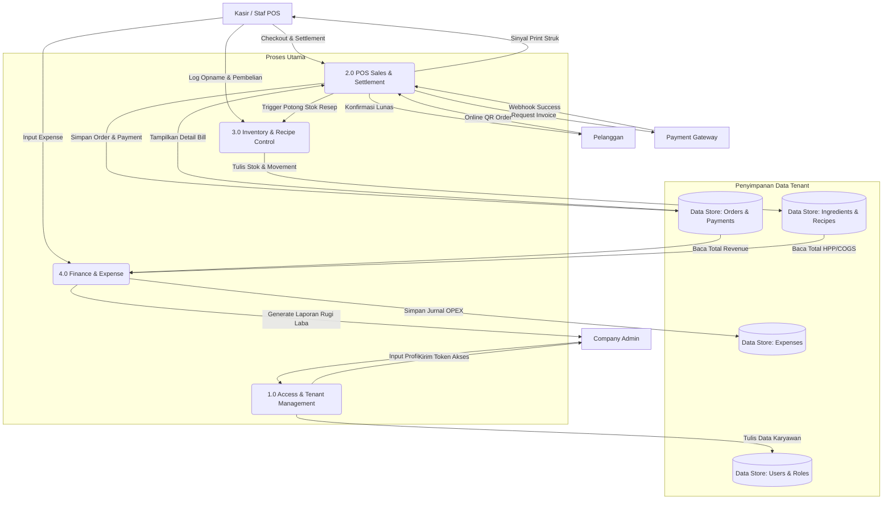
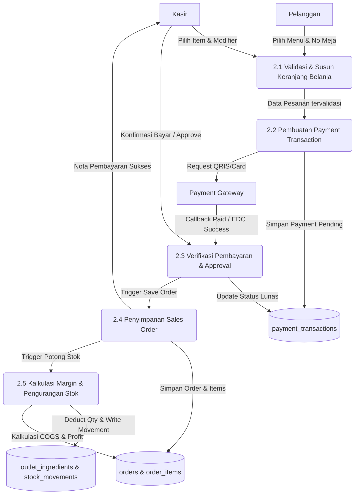

# 17. Data Flow Diagrams (DFD)

Dokumentasi diagram aliran data (Data Flow Diagram - DFD) dari Level Konteks, Level 0, hingga DFD Level 1 pada Aplikasi UMKM.

---

## 1. DFD Konteks (Context Diagram)
Menggambarkan batasan sistem (system boundary) dan entitas luar (*external entities*) yang berinteraksi mengirim/menerima data dengan sistem.

---

## 2. DFD Level 0
Memecah sistem utama menjadi 4 proses pengolahan data makro:
1. **Proses 1.0**: Access & Tenant Management.
2. **Proses 2.0**: POS Sales & Settlement.
3. **Proses 3.0**: Inventory & Recipe BOM Control.
4. **Proses 4.0**: Finance Accounting & Expense.

---

## 3. DFD Level 1: Proses 2.0 (POS Sales & Settlement)
Memecah alur pemrosesan data order dan pembayaran secara detail.

