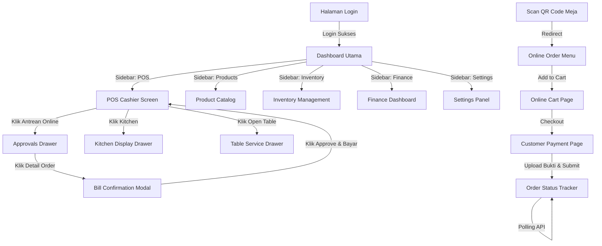

# 18. User Interface (UI) Flow & User Journey

Analisis alur perpindahan halaman (Screen Flow), navigasi menu Single Page Application (SPA), dan alur perjalanan pengguna (User Journey) pada Aplikasi UMKM.

---

## 1. Navigasi & Struktur SPA (Routing & Layout)

Aplikasi POS Kasir dan halaman Admin berjalan sebagai Single Page Application (SPA) yang dinamis. Halaman tidak melakukan reload penuh saat berpindah menu, melainkan mengganti konten DOM dan memuat bootstrap state melalui helper `loadPageBootstrap(page)`.

### Peta Navigasi Halaman Utama (Main Sidebar)

```
Dashboard (/)
 ├── POS Kasir (/pages/pos.html)
 ├── Antrean Dapur (KDS Drawer)
 ├── Antrean Approve (Approvals Drawer)
 ├── Open Table Manager (Tables Drawer)
 ├── Riwayat Order (/pages/orders.html)
 ├── Manajemen Produk (/pages/products.html)
 │    ├── Kategori (/pages/categories.html)
 │    ├── Modifiers (/pages/modifiers.html)
 │    └── Resep Menu (/pages/recipes.html)
 ├── Manajemen Inventaris (/pages/inventory.html)
 │    ├── Pembelian Bahan (/pages/purchases.html)
 │    ├── Produksi Preorder (/pages/finished-products.html)
 │    └── Mapping Bahan (/pages/ingredient-mapping.html)
 ├── Finansial & OPEX (/pages/finance-expenses.html)
 ├── Laporan Rugi Laba (/pages/reports.html)
 └── Pengaturan Toko (/pages/settings.html)
```

---

## 2. Diagram Alur Transisi Halaman (Screen Flow Diagram)



---

## 3. Alur Perjalanan Pengguna (User Journey Mapping)

### A. Kasir POS (Memproses Pembayaran QRIS)
1. **Langkah 1**: Kasir login ke sistem, memilih outlet aktif, lalu masuk ke halaman POS.
2. **Langkah 2**: Kasir memasukkan item pesanan pelanggan ke keranjang jualan (cart).
3. **Langkah 3**: Kasir menekan tombol "Bayar Sekarang".
4. **Langkah 4**: Sistem menampilkan panel checkout. Kasir memilih metode pembayaran "QRIS".
5. **Langkah 5**: Sistem mengirim request ke Xendit/Midtrans, lalu menampilkan pop-up QR code dinamis di layar POS yang menghadap ke pelanggan.
6. **Langkah 6**: Setelah pelanggan memindai dan membayar, webhook sukses memicu sistem POS secara otomatis. Modal QR ditutup, struk pembayaran tercetak otomatis, dan kasir kembali ke layar produk kosong.

### B. Pelanggan Mandiri (Order & Bukti Bayar)
1. **Langkah 1**: Pelanggan men-scan QR code di sudut meja makan. Halaman menu pemesanan terbuka di browser mobile.
2. **Langkah 2**: Pelanggan memilih menu makanan, menentukan tingkat kepedasan/modifier, lalu menambahkannya ke keranjang belanja digital.
3. **Langkah 3**: Pelanggan mengisi formulir data diri (Nama & Nomor Telepon), lalu memilih metode bayar "Transfer Bank".
4. **Langkah 4**: Halaman menampilkan nomor rekening outlet. Pelanggan melakukan transfer via M-Banking, meng-screenshot bukti transfer, mengunggah file gambar ke form online menu, lalu mengklik "Confirm Order".
5. **Langkah 5**: Layanan memproses upload gambar, mengirim data pesanan ke kasir POS dengan status menunggu approval (`PENDING_CASHIER`), dan menampilkan layar pelacakan "Pesanan Anda sedang menunggu persetujuan kasir".
6. **Langkah 6**: Pelanggan memantau status pesanan hingga berubah menjadi "Sedang Dimasak", "Siap Disajikan", dan akhirnya "Selesai".
